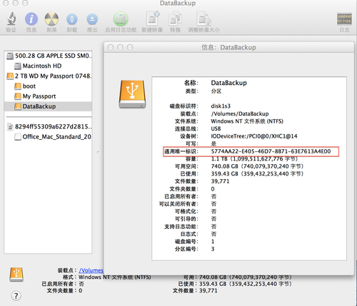
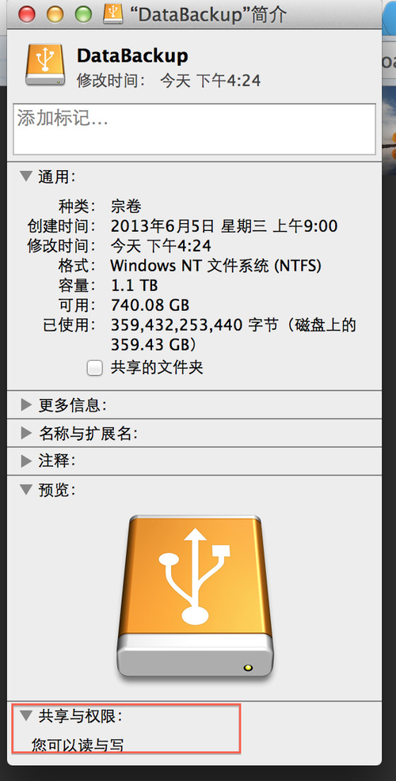

mac os内建了对ntfs分区的支持，但是出于众所周知的原因，默认没有提供以读写方式挂载的选项，只好通过修改系统设置的方式来达到目的，原理是通过编辑/etc/fstab添加分区标识，强制让系统以读写方式挂载指定的ntfs分区
首先，需要确认要挂载的ntfs分区的UUID，又叫通用唯一标识，用来标识分区，通过打开 磁盘工具，选中分区，点击信息，打开下图，即可确定

<!-- more -->
也可以在终端里输入如下命令查询

``` bash
diskutil info /Volumes/DataBackup/ | grep UUID
```
其中/Volumes/DataBackup为ntfs分区的卷标，简单说就是分区名称
确定了UUID之后，就可以编辑/etc/fstab添加分区条目，在终端输入如下命令
``` bash
sudo vifs
```

根据提示，输入密码，打开编辑界面，输入
``` bash
UUID=5774AA22-E405-46D7-8B71-63E7613A4E00 none ntfs rw,auto,nobrowse
```
把UUID＝后面的标识换成上面查询到的值，然后输入:wq保存退出
由于采用这个办法，分区挂载以后为nobrowser，即在Finder中是看不到的，需要手工建立链接，使用如下命令

``` bash
ln -s /Volumes/DataBackup ~/Desktop/HD_DataBackup
```

然后就可以在桌面访问了，打开以后，分区挂载即为可读写状态

需要注意的是，挂载的硬盘，之前在windows上，必须使用安全弹出卸载，如果强行拔出，会导致文件系统日志出错，在mac os下将无法通过以上办法挂载，错误消息可以通过console日志查看