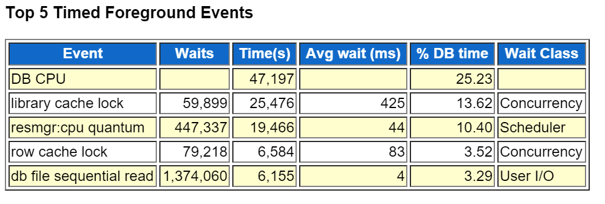
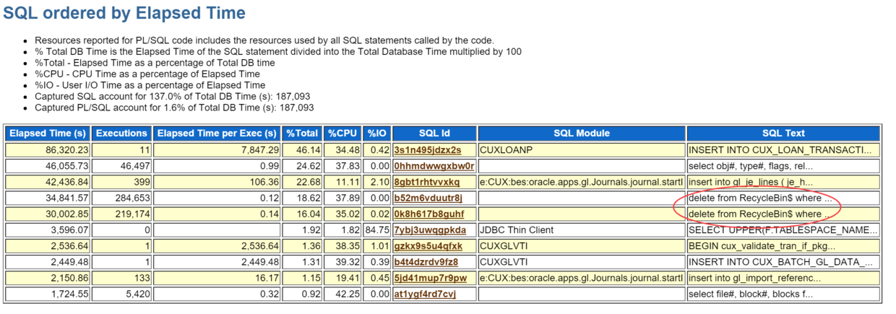

目前在客户这里遇到一个问题，生产环境的Oracle数据库批处理突然运行非常缓慢，处理过程平均花费时间为平时的2倍以上，所有会话卡在一个insert语句上：
 ```sql
insert into cux_loan_transactions
           select /*parallel(8,t)*/ * from cux_loan_transaction_temp;
```
鉴于这个语句没有任何特殊之处，所以运行的慢就显得非常奇怪，于是决定从数据库层面着手，先运行了最近的一个awr报告，果然在awr报告上，有一些奇怪的事件，不太正常，如下图可以看到，library cache lock和row cache lock事件有较多等待

<!-- more -->
这个library cache lock事件简单来说：
>Oracle利用Library cache lock和Library cache pin来实现并发控制，Library cache lock是在handle上获取的，而Library cache pin则是在data heap上获取。访问对象时，首先必须获取handle上的lock，简而言之，就是个对象锁

这个对象锁是系统的机制，很正常，可是为什么会有茫茫多的等待，锁等待说明有对象访问冲突，需要排队，但是前面说了，只是一个再简单不过的insert 语句，哪来的锁冲突。显然，有别的鬼!来看一下top sql



注意标红的部分，居然是delete recyclebin$，在清理回收站！可以确定，这个是系统自动触发的回收站清理，去看了下数据表空间的使用率为77%，也佐证了这个结论。可是回收站清理，为什么会导致系统这么缓慢？

确定了问题sql以后，我又去看了下运行缓慢的会话正在执行的sql部分，然后发现：


真的在这个会话里面，存在清理recyclebin的语句。。。，另外查看了这个会话的对象锁，问题终于确定了，这个会话的确会触发recyclebin$的行锁，由于一开始的insert 语句是并发执行的，实际上每个insert语句会启动8个会话，而如果每个会话里面都会有清理 recyclebin的语句在执行，并且是针对同一对象的，那么的确会引起行锁冲突，从而导致实际上并行的8个会话互斥，需要排队执行，而清理recyclebin这个操作，实际上是很慢的，从而引起了很多的Library cache lock的事件等待。

事情到这里，基本上就清楚了，但是为什么oracle会在会话里带出来清理回收站的语句？为什么清理回收站的语句在并发执行的时候又会出现行锁冲突？目前并没有找到更确切的解释。我根据发生的现象判断，oracle 自动清理回收站的动作，应该在session级别的触发器里启动的，因此会和正常的会话一起执行，由于insert语句使用了并发执行，所以这个启动动作等于同时并行执行了，在起始参数一致的情况下，就不难想象，会发生行锁冲突了。

导致自动清理recyclebin这个事件发生的原因，一个是表空间使用率比较高，一个是回收站里面对象也比较多，有50多万对象，而且因为业务需要，每天都会有比较多的接口表被drop掉，回收站空间也比较大。在需要写入大量数据的时候，oracle为了释放空间，就开始自动清理回收站了。

找到了问题，就比较好解决了，实际上，在手工清理了回收站以后，系统运行速度立马就恢复了正常。 清理语句如下：
```sql
purge recyclebin;
```
通过这个事件，我们需要注意几个事情：
1. recyclebin是需要定期清理的，否则不知道什么时候就会出现这样的问题，坑你一下
2. recyclebin的自动清理机制在会话出现并发执行的情况下，是有问题的
3. recyclebin不怎么用的话，还是关了吧，太坑爹了