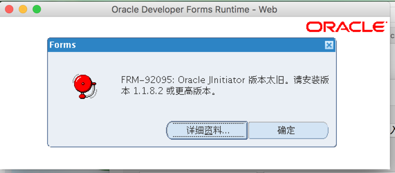
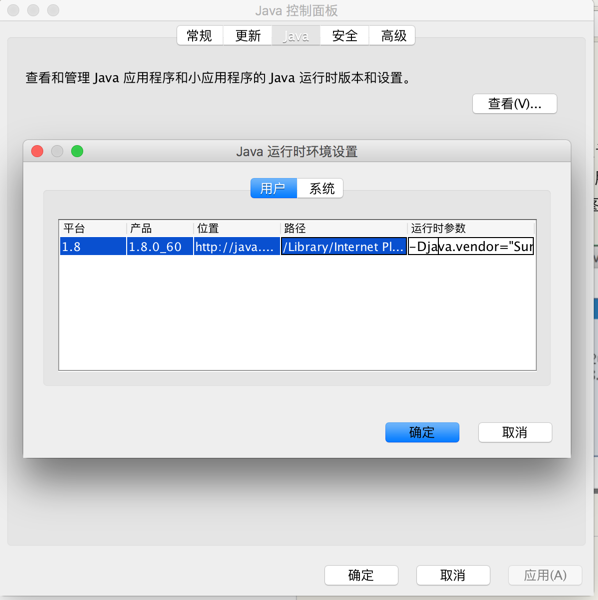
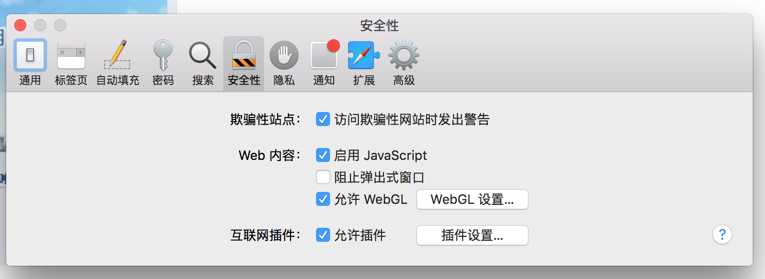

目前oracle ebs 的常用版本都已经认证了java 8,以及mac os。但是由于服务器端需要应用patch才能正常支持java 7,8。所以在服务器端没有正常打patch的情况下，在mac os上登录ebs，会提示错误frm-92095，如下图：

<!-- more -->
解决该问题，需要按照如下步骤设置：
1. 打开java 控制面板，点击java->查看，在打开的界面中，列出的对应的java版本行中，运行时参数框中输入：-Djava.vendor="Sun Microsystems Inc."
如下图

即可解决frm-92095的问题，之所以会出现这个问题，是因为ebs服务器端的java版本为java 6，当时java6还是属于sun公司的，在被oracle收购以后，java7 以后的版本，Djava.vendor这个参数默认值就变成了Oracle，所以服务器端检查时就不匹配了，需要手工设置成Sun,以保持跟服务器端一致。

另外，还需要将站点加入到java控制面板的安全性页的可信任站点中，需要带上端口号，比如
http://ebsdemo.wicp.net:8010
并使safari允许弹出窗口，在插件设置中允许java插件

