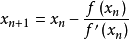

在学习rust的过程中，了解了高阶函数的知识，说白了就是函数可以作为参数，也可以返回一个函数，正好最近看到了scip公开课里面讲高阶过程这一章，有个求平方根的过程，里面的lisp实现相当的简洁优美，基本是对数学公式的形式化书写。这里用rust实现一下，看看区别有多大。
主要实现了传入函数作为参数，并将函数作为返回值，并以函数式风格实现了平方根求值。
<!-- more -->
以下是实现过程和具体代码:
rust中参数的函数类型是以trait来实现的，这样的trait有三个，分别是FnOnce,FnMut,Fn
>* FnOnce
 : 可以调用一次，会转移执行环境中的值
* FnMut
 : 可变引用可以调用多次，可以改变执行环境中的值. 继承自FnOnce(所有实现了FnMut的类型也实现了FnOnce).
* Fn
 : 共享引用，可以调用多次.既不可以转移，也不可以改变执行环境的值. 继承自FnMut，同样也继承自FnOnce

对应的trait定义
```rust
pub trait Fn<Args> : FnMut<Args> {
   extern "rust-call" fn call(&self, args: Args) -> Self::Output;
}
pub trait FnMut<Args> : FnOnce<Args> { 
   extern "rust-call" fn call_mut(&mut self, args: Args) -> Self::Output;
}
pub trait FnOnce<Args> { 
   type Output; extern "rust-call" fn call_once(self, args: Args) -> Self::Output;
}
```
牛顿迭代公式

首先实现求导函数，传入参数类型为函数，并返回导函数的一阶近似，结果是针对原函数的一个计算，依然以函数的形式返回。因为肯定会多次调用，所以使用Fn，这里传入和返回的函数都是同一个类型，即`Fn(f64)->f64`，由于返回值引用了传入参数，所以需要指定lifetime 'a，以保证传入参数不会提前失效，并需要Box包装，以便确定返回类型的大小。这里返回函数是以闭包的形式，由于闭包的lifetime为当前函数，要想返回这个闭包并且在函数以外调用，需要使用move转移闭包。
```rust
//导函数
const DX: f64 = 0.000001;//微分函数的分母，尽可能的小，但由于浮点数的精度限制，取得太小，反而误差会扩大
fn deriv<'a, F>(f: &'a F) -> Box<Fn(f64) -> f64 + 'a>
    where F: Fn(f64) -> f64 
{
    Box::new(move |x| (f(x + DX) - f(x - DX)) / (2.0 * DX))
}
```

牛顿迭代法的实现，调用了上面实现的导函数
```rust
//牛顿迭代法近似
fn newton<'a, F>(f: &'a F) -> Box<Fn(f64) -> f64 + 'a>
    where F: Fn(f64) -> f64 
{
    Box::new(move |x| x - (f(x) / deriv(f)(x)))

}
```

通过不动点算法，用牛顿迭代函数逼近所求的值，当误差小于某个值的时候，返回结果。这里的trans函数是针对函数fnt的迭代函数，因此其类型为函数，其输入参数也为函数，对应的trait：`Fn(&'a F) -> Box<Fn(f64) -> f64 + 'a>`
```rust
//函数不动点逼近
fn fixed_point<'a, F, T>(fnt: &'a F, trans: T, first_guess: f64) -> f64
    where F: Fn(f64) -> f64,
          T: Fn(&'a F) -> Box<Fn(f64) -> f64 + 'a> 
{
    let tolerance = 0.0000001;
    let close_enough = |a: f64, b: f64| (a - b).abs() > tolerance;
    let f = trans(fnt);
    let mut guess = first_guess;
    let mut next: f64 = f(guess);
    while close_enough(guess, next) {
        // println!("guess next:{}", next);
        guess = next;
        next = f(next);
    }
    next
}
```
求平方根函数，即y^2=x，对应y既为x的平方根，对于函数y^2-x应用牛顿迭代函数，使用不动点函数进行计算。
```rust
fn sqrt(x: f64) -> f64 {

    let func = |y: f64| y.powi(2) - x;
    fixed_point(&func, newton, 1.0)
}
```

测试结果
```rust
fn main() {
    let x = 2.0;
    let func = |y: f64| y.powi(2) - x;
    let dx = deriv(&func);
    println!(" derivative y^2-x:{}", dx(1.0));
    let y = newton;
    let nt = y(&func);
    println!("newton method:{}", nt(1.4142));
    let val = fixed_point(&func, newton, 1.0);
    println!("fixed point,sqrt:{}", val);
    let x = 3.0;
    println!("sqrt(x):{}={}", x, sqrt(x));
}
```
可以看到和lisp比起来，rust实现这种函数式编程，还是很别扭，没有lisp那么直观，不过也足够简洁了，闭包还是很强大的。
实际上，如果只是简单的这种方法求平方根，过程式方法一样可以实现。这里最重要的是fixed_point实现了一种求不动点的通用算法，参数里的fnt和trans函数可以有很多中不同的实现，比如平方根求值，可以用牛顿迭代法的二次逼近，也可以用线性迭代的一次逼近。而依据函数不动点定理，可以对很多不同的函数求解。只需要实现其函数式，并代入到fixed_point函数即可。实际上是一种函数式抽象。

附注：对应的lisp实现
来源：[SICP Higher-Order Procedures](https://mitpress.mit.edu/sicp/full-text/book/book-Z-H-12.html#%_sec_1.3)
```lisp
(define (deriv g)
  (lambda (x)
    (/ (- (g (+ x dx)) (g x))
       dx)))

(define (newton-transform g)  
  (lambda (x)
    (- x (/ (g x) ((deriv g) x)))))

(define tolerance 0.00001)
(define (fixed-point f first-guess) 
  (define (close-enough? v1 v2)
    (< (abs (- v1 v2)) tolerance))
  (define (try guess)
    (let ((next (f guess)))
      (if (close-enough? guess next)
          next
          (try next))))
  (try first-guess))

(define (fixed-point-of-transform g transform guess) 
    (fixed-point (transform g) guess))

(define (sqrt x)
  (fixed-point-of-transform (lambda (y) (- (square y) x))
                            newton-transform
                            1.0))
```