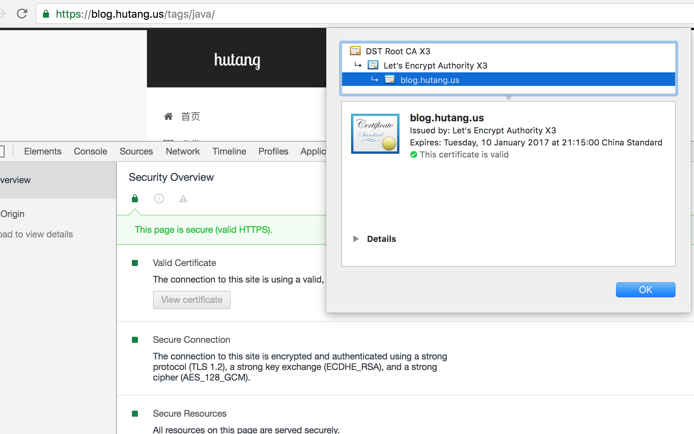

网站启用https访问，首先需要一个证书机构颁发的ssl证书，目前给个人免费颁发证书的机构，比较好的是：[let's encrypt](https://letsencrypt.org)。免费，安装方便，配置简单，值得信赖。    
let's encrypt的证书现在支持自动颁发安装，客户端工具为certbot，官方网站：[https://certbot.eff.org/](https://certbot.eff.org/)，不同的操作系统，certbot程序名称不一样，我的服务器为ubuntu，对应的程序是:
> `letsencrypt`
<!-- more -->

## 创建证书
安装let's encrypt 客户端
```bash
sudo apt-get update
sudo apt-get install letsencrypt
```
使用letsencrypt创建证书，如下所示，可以指定多个域名
```
letsencrypt certonly --webroot -w /var/www/blog -d blog.xxx.org -w /var/www/thing -d thing.is -d m.thing.is
```
生成的域名保存在目录：`/etc/letsencrypt/live/blog.xxx.org/`中:
* cert.pem: 域名证书
* chain.pem: Let's Encrypt chain 证书
* fullchain.pem: cert.pem 和 chain.pem 组合证书
* privkey.pem: 证书私钥

生成强Diffie-Hellman Group(可选)    
```
sudo openssl dhparam -out /etc/ssl/certs/dhparam.pem 2048
```

## 配置nginx
修改nginx配置文件，将对应域名修改为https访问，修改server配置如下
```
server {
  listen 443 ssl  http2 default_server;
  root /var/www/blog; # 这里是你网站的路径 路径下包含index.html等一系列文件
  index index.html index.htm;

  server_name blog.hutang.us;
  ssl_certificate /etc/letsencrypt/live/blog.hutang.us/fullchain.pem;
  ssl_certificate_key /etc/letsencrypt/live/blog.hutang.us/privkey.pem;
  ssl_ciphers "EECDH+CHACHA20:EECDH+CHACHA20-draft:EECDH+AES128:RSA+AES128:EECDH+AES256:RSA+AES256:EECDH+3DES:RSA+3DES:!MD5";
  ssl_ecdh_curve secp384r1;
  ssl_protocols TLSv1 TLSv1.1 TLSv1.2;
  ssl_prefer_server_ciphers on;
  ssl_session_cache shared:SSL:10m;
  ssl_session_tickets off;
  ssl_stapling on;
  ssl_stapling_verify on;

  ssl_dhparam /etc/ssl/certs/dhparam.pem;

  #允许访问let's encrypt 的webroot 插件目录
  location ~ /.well-known {
                allow all;
  }
}
```
http访问重写至https
```
server {
  listen 80;
  server_name blog.xxx.org;
  rewrite ^(.*)$ https://$host$1 permanent;
}
```
其他域名重定向
```
server {
  server_name xxx.org;
  return 301 https://blog.xxx.org$request_uri;
}
```
配置完成以后，重启nginx: `sudo systemctl restart nginx`

然后就可以通过https访问你的网站了，如图：


## 证书更新
let's encrypt的证书有效期为3个月，到期之前需要重新生成才能继续使用，通过以下命令重新生成证书：    
`letsencrypt renew `

可以配置计划任务定时更新证书，以免忘记。
### 配置systemd 计划任务
* 创建letsencrypt服务，新建文件: `/etc/systemd/system/letsencrypt.service`，输入以下内容：
```
[Unit]
Description=letsencrypt renew
 
[Service]
Type=simple
ExecStart=/usr/bin/letsencrypt renew
ExecStop=
```
* 启用服务    
`sudo systemctl enable letsencrypt.service`
* 创建定时器，新建文件: `/etc/systemd/system/letsencrypt.timer` 输入以下内容：
```
[Unit]
Description=run letsencrypt renew every day
 
[Timer]
OnBootSec=10min
OnUnitActiveSec=12h
Unit=letsencrypt.service

[Install]
WantedBy=multi-user.target
```
OnBootSec表示系统启动后执行    
官方建议计划为每12小时执行一次，实际上renew程序在证书到期之前都不会执行任何操作。
* 启用定时器，开机启动  
`sudo systemctl enable letsencrypt.timer`
* 开启定时器    
`sudo systemctl start letsencrypt.timer`
